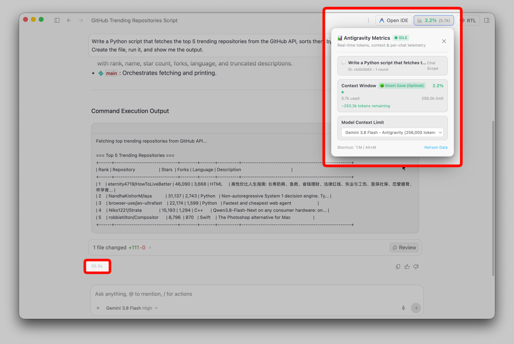

# Antigravity Metrics

Real-time token usage, context limits, per-turn duration, and telemetry for Antigravity and Antigravity IDE.



## Features

- **Header button** showing context usage: `[ 📊 4.8% (48.2k) ]`
- **Flyout dashboard** (`⌥M` / `Alt+M`) with context window health, zone indicators, and model limit selection
- **Per-turn duration** rendered inline in each message's action row
- Model presets: Gemini 3.8 Flash (256k), Gemini Pro Extended (2M), Claude 3.7 Sonnet (200k), GPT-4o (128k), and custom limits

## Install

Requires Node.js 20+. Close Antigravity before patching.

```bash
npx antigravity-metrics          # auto-detect and patch all installs
```

| Platform | Command |
| :--- | :--- |
| macOS | `npx antigravity-metrics` |
| Linux | `sudo npx antigravity-metrics` |
| Windows | `npx antigravity-metrics` (run as Administrator) |

## CLI Options

| Flag | Description |
| :--- | :--- |
| `--ide` | Patch only Antigravity IDE |
| `--app` | Patch only the Standalone App |
| `--restore` / `-r` | Restore original files from backup |
| `--path <dir>` | Custom installation path |

## Uninstall

```bash
npx antigravity-metrics --restore
```

## How It Works

The patcher extracts `app.asar` (Standalone) or hooks `resources/app/out/main.js` (IDE), injects a telemetry hook that watches the session transcript, and repacks. Preferences live in `~/.antigravity-metrics.json`. Compatible with [antigravity-rtl](https://github.com/mmnaderi/antigravity-rtl).

## License

MIT
